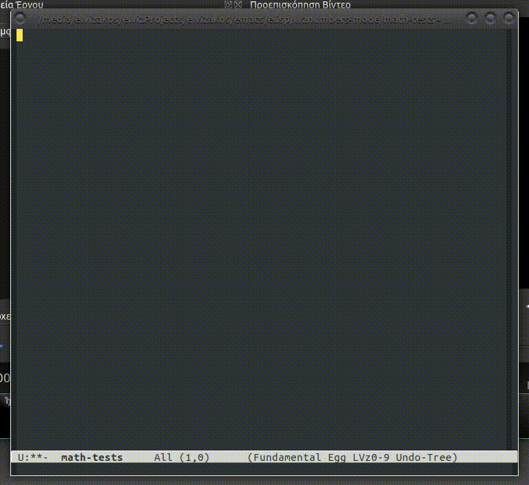

# lvznumbers-mode #

[](./COPYING)

lvznumbers-mode is a minor mode for working with numbers and math on emacs.

<!-- markdown-toc start - Don't edit this section. Run M-x markdown-toc-generate-toc again -->
**Table of Contents**

- [lvznumbers-mode](#lvznumbers-mode)
    - [Installation](#installation)
        - [Build package](#build-package)
        - [Installing package](#installing-package)
        - [Simple Installation](#simple-installation)
    - [Usage](#usage)
        - [Increments, Decrements](#increments-decrements)
        - [Math](#math)
            - [Math format](#math-format)
                - [Math Operations](#math-operations)
                    - [Powers](#powers)
                    - [Roots](#roots)
                    - [Divisions](#divisions)
                    - [Float Divisions](#float-divisions)
                    - [Integer Divisions](#integer-divisions)
                    - [Division remander](#division-remander)
                    - [Multiplications](#multiplications)
                    - [Subtractions](#subtractions)
                    - [Additions](#additions)
                - [Order of operations](#order-of-operations)
            - [Examples](#examples)
        - [Shortcuts](#shortcuts)

<!-- markdown-toc end -->

## Installation ##

### Build package ###

```bash
## Create empty file "lvznumbers-mode-autoloads"
echo "" > lvznumbers-mode-autoloads

## Clear previous package build files
make clean

## Make package
make
```

### Installing package ###

```bash

cd ..

## Install package
tar -xvf "./<TAR_FILE_PACKAGE>"  -C "~/.emacs.d/elpa/"

```

### Simple Installation ###
This can also be installed by adding somewhere in emacs init file the following line:
```lisp
(load "/path/to/lvznumbers-mode.el")
```

## Usage ##

### Increments, Decrements ###

With cursor right before, in, or after a number pressing the combination <kbd>C-c &lt;UP&gt;</kbd> will increace it by one decimal unit.
Using the universal argument without adding a number <kbd>C-u C-c &lt;UP&gt;</kbd> the number will be increased by 4 and with double universal argument <kbd>C-u C-u C-c &lt;UP&gt;</kbd> the number will be increased by 16.
Using the universal argument by adding a number <kbd>C-u 30 C-c &lt;UP&gt;</kbd> the number will be increased by the given number.

#### Ideas ####

For each line in the following list, found the second number and increase it by one:

```
1. list item 0
2. list item 1
3. list item 2
4. list item 3
```

Solution:

  1. <kbd>F3</kbd>
  2. <kbd>C-a</kbd>
  3. <kbd>SPC</kbd>
  4. <kbd>C-a</kbd>
  5. <kbd>C-u 2 C-c C-n C-n</kbd>
  6. <kbd>C-c &lt;UP&gt;</kbd>
  7. <kbd>C-a</kbd>
  8. <kbd>C-d</kbd>
  9. <kbd>C-n</kbd>
  10. <kbd>F4</kbd>
  11. <kbd>C-u 3 F4</kbd>

### Math ###
By selecting an area and pressing <kbd>C-M-z m</kbd> all math in selection will be replaced by their result.

#### Math format ####

##### Math Operations #####

###### Powers ######

Examples:
`3 ** 2 = 9.0`
`3 ^ 2 = 9.0`
`3 ** 3 = 27.0`
`3 ^ 3 = 27.0`

###### Roots ######

Examples:
`9 √ 2 = 3.0`
`9 // 2 = 3.0`
`9 ^ (1 / 2) =  3.0`
`9 ** (1 / 2) =  3.0`

###### Divisions ######

###### Float Divisions ######
Examples:
`10 / 3 = 3.3333333333333335`
`10 ÷ 3 = 3.3333333333333335`
`10 : 3 = 3.3333333333333335`

###### Integer Divisions ######
Examples:
`10 \ 3 = 3`

###### Division remander ######
Examples:
`10 % 3 = 1.0`

###### Multiplications ######

Examples:
`3 * 3 = 9.0`
`3 × 3 = 9.0`
`3 · 3 = 9.0`

###### Subtractions ######

Examples:
`10 - 1 = 9.0`
`10 — 1 = 9.0`

###### Additions ######

Examples:
`10 + 1 = 11.0`


##### Order of operations #####
The order of operations following the same order as in mathematics and computer programming:

  1. parenthesis
  2. powers and roots
  3. divisions, integer divisions, division remanders and multiplications
  4. additions and subtractions


#### Examples ####

By selecting the string `2 + 2 * 2 + a` and pressing <kbd>C-M-z m</kbd>, the result will be `6.0 + a`.

By selecting the string `(2 + 2) * 2 + a` and pressing <kbd>C-M-z m</kbd>, the result will be `8.0 + a`.

By selecting the string `2 + 2 * 2 * a` and pressing <kbd>C-M-z m</kbd>, the error message `Args out of range: " a", 4, 8` will appear in minibuffer.

Pressing <kbd>C-M-z m</kbd> when there is no selection, the error message `There is no selection` will appear in minibuffer.



### Shortcuts ###

Key | Command / Function | Universal argument | Description
--- | --- | --- | ---
<kbd>C-c &lt;up&gt;</kbd> | `lvznumbers/increment-number-at-point` | If universal argument used, the number will be increased by universal arguments value. | Increase the decimal number under cursor. This shortcut is defined by the `lvznumbers/increment-keycomb` variable.
<kbd>C-x +</kbd> | `lvznumbers/increment-number-at-point` | If universal argument used, the number will be increased by universal arguments value. | Increase the decimal number under cursor.
<kbd>C-c &lt;down&gt;</kbd> | `lvznumbers/decrement-number-at-point` | If universal argument used, the number will be decreased by universal arguments value. |Decrease the decimal under cursor. This shortcut is defined by the `lvznumbers/decrement-keycomb`.
<kbd>C-x -</kbd> | `lvznumbers/decrement-number-at-point` | If universal argument used, the number will be decreased by universal arguments value. |Decrease the decimal number under cursor.
<kbd>C-x &lt;up&gt;</kbd> | `lvznumbers/increment-digit-at-point` |  | Increase the value of the digit under(before) cursor. This shortcut is defined by the `lvznumbers/increment-digit-keycomb`.
<kbd>C-x &lt;down&gt;</kbd> | `lvznumbers/decrement-digit-at-point` | | Decrease the value of the digit under(before) cursor. This shortcut is defined by the `lvznumbers/decrement-digit-keycomb`.
<kbd>C-c H</kbd> | `lvznumbers/increment-hex-at-point` | If universal argument used, the number will be increased by universal arguments value. | Increase the hexadecimal number under cursor. This shortcut is defined by the `lvznumbers/increment-hex-keycomb`.
<kbd>C-x H</kbd> | `lvznumbers/decrement-hex-at-point` | If universal argument used, the number will be decreased by universal arguments value. |Decrease the hexadecimal number under cursor. This shortcut is defined by the `lvznumbers/decrement-hex-keycomb`.
<kbd>C-c C-n C-n</kbd> | `lvznumbers/goto-next-number` | If universal argument used, it will jump to the Nth number. | Send cursor at the begining of the next decimal number. This shortcut is defined by the `lvznumbers/goto-next-dec-number-keycomb`.
<kbd>C-c C-n C-p</kbd> | `lvznumbers/goto-previous-number` | If universal argument used, it will jump to the Nth number. | Send cursor at the begining of the previous decimal number. This shortcut is defined by the `lvznumbers/goto-previous-dec-number-keycomb`.
<kbd>C-c C-v +</kbd> | `lvznumbers/addition-with-paste` | | Add the number in the kill-ring with the number under cursor and replace the second with the result. This shortcut is defined by the `lvznumbers/addition-with-paste-keycomb`.
<kbd>C-c C-v -</kbd> | `lvznumbers/subtract-paste` | | Subtract the number in the kill-ring from the number under cursor and replace the second with the result. This shortcut is defined by the `lvznumbers/subtract-paste-keycomb`.
<kbd>C-c C-v *</kbd> | `lvznumbers/multiply-paste` | | Multiply the number in the kill-ring with the number under cursor and replace the second with the result. This shortcut is defined by the `lvznumbers/multiply-paste-keycomb`.
<kbd>C-c C-v /</kbd> | `lvznumbers/divide-paste` | | Divide the number under cursor with  the number in the kill-ring and replace the first with the result. This shortcut is defined by the `lvznumbers/divide-paste-keycomb`.
<kbd>C-c C-v C-c +</kbd> | `lvznumbers/addition-and-copy` | | Add the number in the kill-ring with the number under cursor and replace the first with the result. This shortcut is defined by the `lvznumbers/addition-and-copy-keycomb`.
<kbd>C-c C-v C-c -</kbd> | `lvznumbers/subtract-copy` | | Subtract the number in the kill-ring from the number under cursor and replace the first with the result. This shortcut is defined by the `lvznumbers/subtract-copy-keycomb`.
<kbd>C-c C-v C-c *</kbd> | `lvznumbers/multiply-copy` | | Multiply the number in the kill-ring with the number under cursor and replace the first with the result. This shortcut is defined by the `lvznumbers/multiply-copy-keycomb`.
<kbd>C-c C-v C-c /</kbd> | `lvznumbers/divide-copy` | | Divide the number in the kill-ring with the number under cursor and replace the first with the result. This shortcut is defined by the `lvznumbers/divide-copy-keycomb`.
<kbd>C-; m m</kbd> | `lvznumbers/do-math-on-region` | | Do all math in selected area.  This shortcut is defined by the `lvznumbers/do-math-on-region-keycomb`.
<kbd>C-M-z m</kbd> | `lvznumbers/do-math-on-region` | | Do all math in selected area.  This shortcut is defined by the `lvznumbers/do-math-on-region-keycomb-alt`.
<kbd>C-; m C-y</kbd> | `lvznumbers/do-math-on-kill-ring-and-paste` | | Do all math in kill-ring and paste the result. This shortcut is defined by the `lvznumbers/do-killring-and-paste-keycomb`.
<kbd>C-; m C-v</kbd> | `lvznumbers/do-math-on-kill-ring-and-paste`  | | Do all math in kill-ring and paste the result. This shortcut is defined by the `lvznumbers/do-killring-and-paste-keycomb-alt`.
<kbd>C-; m M-w</kbd> | `lvznumbers/do-math-on-region-and-copy` | | Do all math in selected area and replace kill-ring with the result. This shortcut is defined by the `lvznumbers/do-region-and-copy-keycomb`.
<kbd>C-; m C-c</kbd> | `lvznumbers/do-math-on-region-and-copy` | | Do all math in selected area and replace kill-ring with the result. This shortcut is defined by the `lvznumbers/do-region-and-copy-keycomb-alt`.
